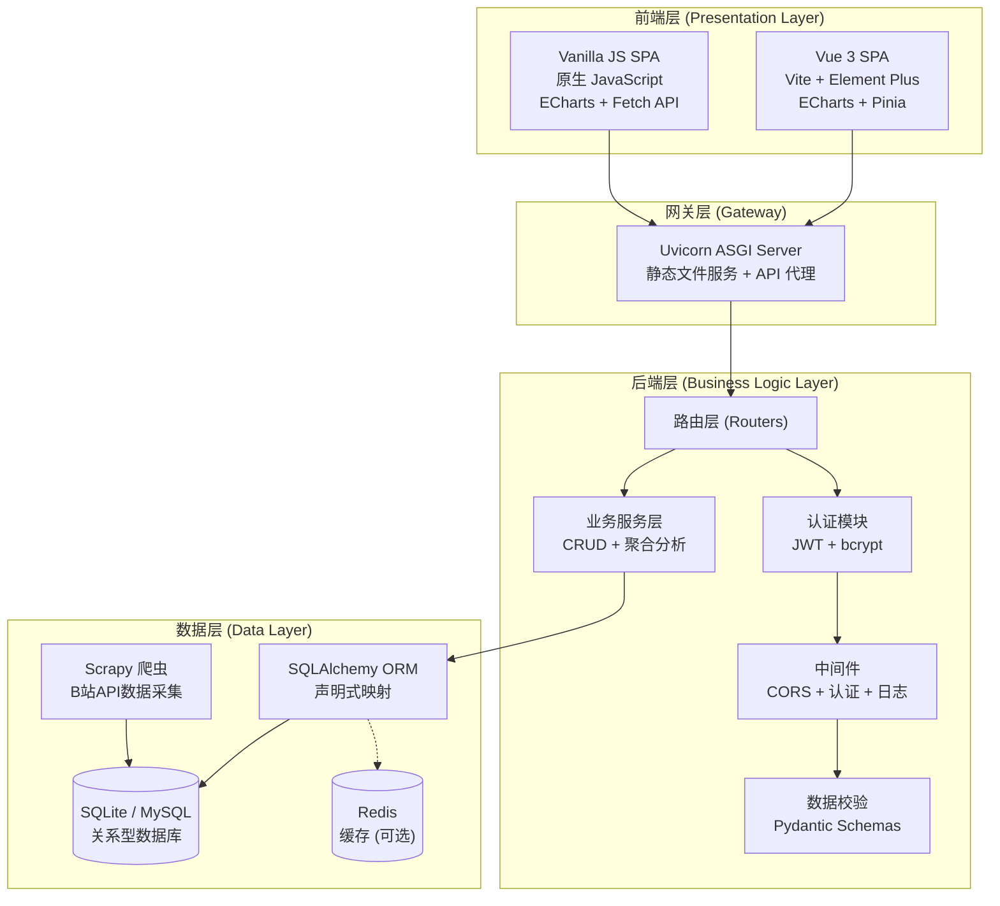
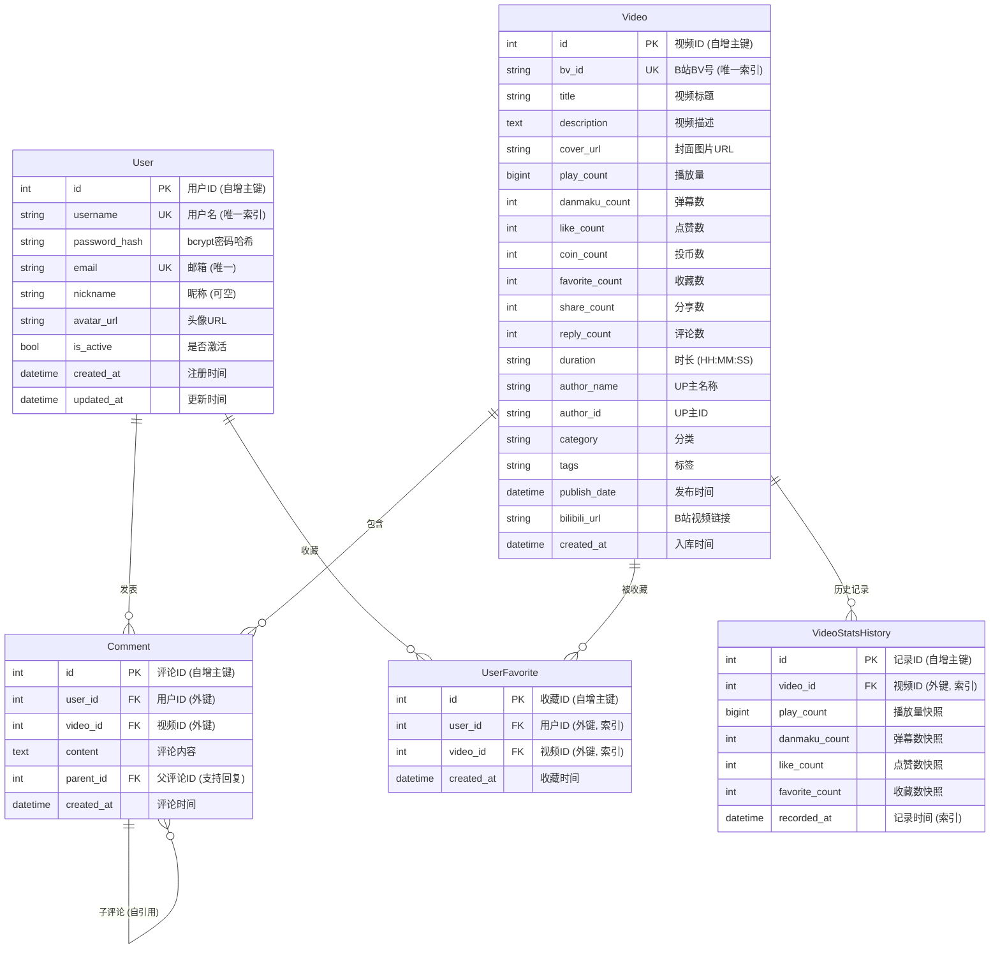
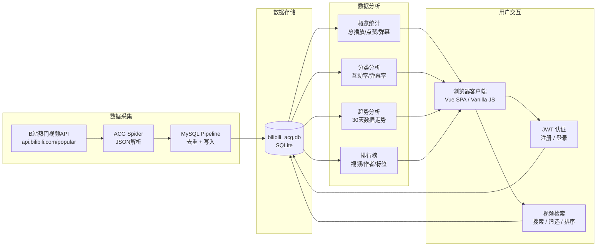
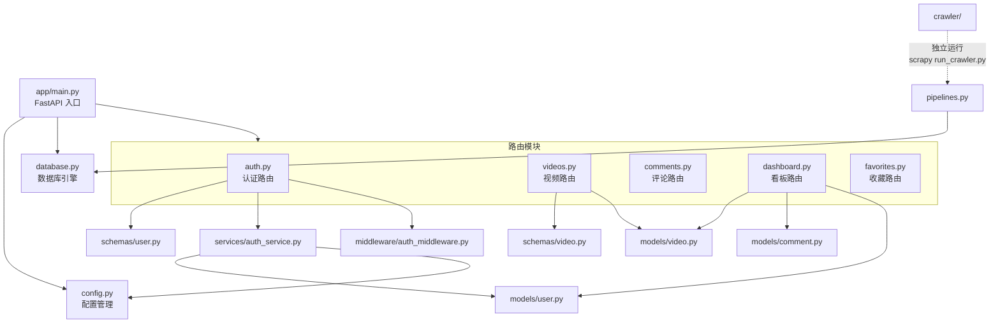

# B站ACG视频数据统计分析系统 —— 毕业论文技术文档

---

## 第一章 系统概述

### 1.1 项目背景

本系统是一个面向B站（Bilibili）ACG（动画、漫画、游戏）领域的视频数据统计分析平台。系统通过爬虫自动采集B站视频数据，对数据进行清洗、存储、多维度分析，并以可视化大屏和数据看板的形式呈现分析结果。

### 1.2 系统功能模块

系统共包含六大核心功能模块：

| 模块 | 功能描述 |
|------|---------|
| **数据采集模块** | 基于 Scrapy 框架爬取B站热门视频数据，支持定时增量更新 |
| **用户认证模块** | JWT 令牌认证，支持注册、登录、个人信息管理、头像上传 |
| **视频浏览模块** | 视频列表分页展示、关键词搜索、分类筛选、多维度排序 |
| **数据看板模块** | 多维度统计分析：分类分布、UP主排行、标签云、互动率分析、时长分析 |
| **可视化大屏模块** | 全屏数据展示，适配大屏投放，含实时时钟、KPI卡片、雷达图、南丁格尔玫瑰图 |
| **个人中心模块** | 用户收藏管理、头像/昵称修改、密码修改、个人统计 |

### 1.3 使用场景

- 数据看板（Dashboard）：面向数据分析人员，提供深度交互式分析工具
- 可视化大屏（Large Screen）：面向展示场景，适合展厅大屏投放，强调视觉效果
- 视频浏览与搜索：面向普通用户，提供视频检索与详情查看

---

## 第二章 技术栈详解

### 2.1 技术选型总览

```
┌─────────────────────────────────────────────────────────────────────┐
│                         前端层 (Frontend)                            │
│  ┌─────────────────────┐  ┌──────────────────────────────────┐     │
│  │   Vue 3 SPA (主)     │  │   Vanilla JS SPA (静态备选)       │     │
│  │   Vite 5 + Element+  │  │   原生 JS + ECharts + CSS        │     │
│  │   Pinia + Vue Router │  │   Hash路由 + Fetch API           │     │
│  └─────────────────────┘  └──────────────────────────────────┘     │
├─────────────────────────────────────────────────────────────────────┤
│                         通信层 (Communication)                       │
│  ┌──────────────────────────────────────────────────────────────┐  │
│  │         HTTP RESTful API  /  JSON 数据格式  /  JWT Token      │  │
│  └──────────────────────────────────────────────────────────────┘  │
├─────────────────────────────────────────────────────────────────────┤
│                         后端层 (Backend)                             │
│  ┌────────────┐  ┌────────────┐  ┌────────────┐  ┌────────────┐   │
│  │  FastAPI    │  │  SQLAlchemy│  │  JWT Auth  │  │  Pydantic  │   │
│  │  路由控制器 │  │  ORM 映射  │  │  认证鉴权  │  │  数据校验  │   │
│  └────────────┘  └────────────┘  └────────────┘  └────────────┘   │
├─────────────────────────────────────────────────────────────────────┤
│                         数据层 (Data Layer)                          │
│  ┌──────────────────────┐  ┌──────────────────────────────────┐    │
│  │  SQLite / MySQL       │  │  Scrapy 爬虫引擎                  │    │
│  │  关系型数据库          │  │  数据采集与入库 (Pipeline)         │    │
│  └──────────────────────┘  └──────────────────────────────────┘    │
└─────────────────────────────────────────────────────────────────────┘
```

### 2.2 后端技术详解

#### 2.2.1 FastAPI — Web 框架

FastAPI 是基于 Python 3.8+ 的现代高性能 Web 框架，核心特性：

- **异步支持**：基于 Starlette + ASGI（Uvicorn），原生支持 `async/await`
- **自动文档**：自动生成 OpenAPI (Swagger) 和 ReDoc 交互文档
- **类型安全**：利用 Python 类型提示进行请求参数校验和序列化
- **依赖注入**：内置 Depends() 机制实现依赖注入（如数据库会话、认证中间件）

```python
# FastAPI 路由示例 — 依赖注入模式
@router.get("/overview")
def get_overview(db: Session = Depends(get_db)):
    total_videos = db.query(func.count(Video.id)).scalar() or 0
    # ...
```

**在本项目中的应用：**
- 定义了 5 个路由模块，共 20+ 个 API 端点
- 使用 `Depends(get_db)` 注入数据库会话
- 使用 `Depends(require_auth)` 实现认证保护
- 利用 Pydantic Model 定义请求/响应 Schema

#### 2.2.2 SQLAlchemy — ORM 框架

SQLAlchemy 是 Python 最流行的 ORM，提供：

- **声明式映射**：通过 Python 类映射数据库表
- **查询构造器**：链式调用构建类型安全的 SQL 查询
- **会话管理**：Session 管理数据库连接和事务
- **关系定义**：支持外键、一对多、多对多关系

```python
# 模型定义示例
class Video(Base):
    __tablename__ = "videos"
    id = Column(Integer, primary_key=True, autoincrement=True)
    bv_id = Column(String(20), unique=True, index=True, nullable=False)
    play_count = Column(BigInteger, default=0)
    # ...

# 聚合查询示例
results = db.query(
    Video.category,
    func.count(Video.id).label("count"),
    func.sum(Video.play_count).label("total_plays"),
).filter(Video.category != "").group_by(Video.category).all()
```

#### 2.2.3 JWT 认证机制

系统采用 JSON Web Token (JWT) 实现无状态认证：

```
用户登录 → 验证用户名密码 → 签发 JWT (HS256, 7天有效) → 前端存储 token
     ↓
后续请求 → Authorization: Bearer <token> → 中间件验证签名 → 提取 user_id
```

- **算法**：HMAC-SHA256 (HS256)
- **载荷**：`{user_id, username, exp}`
- **密码哈希**：bcrypt 算法（passlib 库），salt 轮数为 12

#### 2.2.4 Scrapy 爬虫引擎

Scrapy 是一个功能强大的爬虫框架，核心架构：

```
┌──────────────────────────────────────────────────────────┐
│                    Scrapy Engine                          │
│  ┌──────────┐    ┌──────────┐    ┌──────────┐           │
│  │ Scheduler│───▶│ Downloader│───▶│  Spider  │           │
│  │ 请求调度  │    │ 下载器    │    │ 解析器   │           │
│  └──────────┘    └──────────┘    └──────────┘           │
│       ▲                               │                  │
│       │          ┌──────────┐         │                  │
│       └──────────│ Item     │◀────────┘                  │
│                  │ Pipeline │                            │
│                  │ 数据管道  │                            │
│                  └──────────┘                            │
└──────────────────────────────────────────────────────────┘
```

**本项目爬虫流程：**
1. 请求 B站热门视频 API：`api.bilibili.com/x/web-interface/popular?pn={1-16}&ps=50`
2. 每页返回 50 条视频数据，共 16 页，理论可达 800 条
3. Spider 解析 JSON 响应，提取 22 个字段（标题、播放量、弹幕数、分类标签等）
4. 经 Pipeline 去重后写入数据库（按 bv_id 更新或插入）
5. 中间件实现 user-agent 轮换和请求延迟，避免反爬

### 2.3 前端技术详解

#### 2.3.1 Vue 3 + Vite — 现代前端框架

Vue 3 核心特性在本项目中的应用：

| 特性 | 应用场景 |
|------|---------|
| **Composition API** | 使用 `<script setup>` 语法，逻辑更清晰 |
| **响应式系统** | `ref()` / `reactive()` 驱动 UI 自动更新 |
| **单文件组件 (SFC)** | `.vue` 文件整合模板、样式、逻辑 |
| **Vue Router** | SPA 客户端路由：首页、详情、看板、大屏、收藏 |
| **Pinia** | 全局状态管理：用户认证状态持久化（localStorage） |
| **Vite** | 开发环境秒级热更新，生产 Rollup 打包 |

**路由设计：**
```
/login          → LoginView        (游客)
/register       → RegisterView     (游客)
/               → HomeView         (视频列表)
/video/:id      → VideoDetailView  (视频详情)
/dashboard      → DashboardView    (数据看板)
/large-screen   → LargeScreenView  (可视化大屏)
/favorites      → FavoritesView    (个人收藏，需登录)
```

#### 2.3.2 ECharts — 数据可视化

ECharts 5.x 是百度开源的声明式可视化库。本项目使用的图表类型：

| 图表类型 | 使用位置 | 配置要点 |
|---------|---------|---------|
| **南丁格尔玫瑰图** (Pie, roseType:'area') | 大屏分类分布 | 内径30%，外径75%，圆角边框 |
| **横向柱状图** (Bar) | TOP视频、UP主排行、标签云、弹幕排行 | 线性渐变配色、圆角边框 |
| **折线面积图** (Line + areaStyle) | 30天趋势 | 平滑曲线、渐变填充、无数据点标记 |
| **雷达图** (Radar) | 互动维度分析 | 六边形、半透明填充、6维指标 |
| **柱状图** (Bar) | 发布趋势、时长分析 | 分类轴、数值轴、自定义标签 |

**关键技术点：**
- 实例管理：页面切换时 `dispose()` 销毁旧实例防止内存泄漏
- 暗色主题：自定义 `backgroundColor: '#0f0f23'`、`textStyle: {color: '#888'}`
- 渐变配色：`echarts.graphic.LinearGradient(0,0,1,0, [...])`
- `resize` 监听：窗口大小改变时自适应重绘

#### 2.3.3 Element Plus — UI 组件库

基于 Vue 3 的企业级组件库，提供：

- **表单组件**：el-input, el-select, el-button（登录、注册、搜索筛选）
- **布局组件**：el-container, el-row, el-col（页面布局）
- **反馈组件**：el-message（操作提示）
- **数据展示**：el-pagination（分页）、el-tag（标签）、el-empty（空状态）
- **图标库**：@element-plus/icons-vue

#### 2.3.4 Vanilla JS SPA（静态备选前端）

除 Vue 前端外，系统还包含一个纯原生 JavaScript 单页应用（无框架依赖），作为备选方案：

- **路由**：基于 `hashchange` 事件的自定义 Hash 路由
- **渲染**：模板字符串 + innerHTML 动态渲染
- **HTTP**：原生 Fetch API 封装
- **图表**：同样使用 ECharts 5.x
- **功能完整性**：与 Vue 版本功能基本对等，增加个人中心头像上传功能

---

## 第三章 系统架构

### 3.1 整体架构图



### 3.2 系统分层架构

```
┌──────────────────────────────────────────────────────────────┐
│                    展示层 (Presentation)                       │
│  ┌────────────────────┐   ┌─────────────────────────────┐    │
│  │  Vue 3 + Vite SPA  │   │  Vanilla JS SPA (static/)   │    │
│  │  组件化 + 路由 + Store  │   │  Hash路由 + 模板字符串渲染     │    │
│  └────────┬───────────┘   └──────────────┬──────────────┘    │
│           └──────────┬───────────────────┘                    │
│                      │ HTTP RESTful JSON                      │
├──────────────────────┼───────────────────────────────────────┤
│                      │           应用层 (Application)          │
│  ┌───────────────────▼────────────────────────────────────┐  │
│  │                  FastAPI Application                     │  │
│  │  ┌──────────┐ ┌──────────┐ ┌──────────┐ ┌──────────┐   │  │
│  │  │ 认证路由  │ │ 视频路由  │ │ 评论路由  │ │ 看板路由  │   │  │
│  │  │ /auth    │ │ /videos  │ │ /comments│ │ /dashboard│   │  │
│  │  └──────────┘ └──────────┘ └──────────┘ └──────────┘   │  │
│  │  ┌──────────┐                                            │  │
│  │  │ 收藏路由  │     JWT Auth Middleware + CORS             │  │
│  │  │ /user    │     Pydantic Request/Response Validation   │  │
│  │  └──────────┘                                            │  │
│  └──────────────────────────┬───────────────────────────────┘  │
│                             │                                   │
├─────────────────────────────┼──────────────────────────────────┤
│                             │         数据层 (Data)              │
│  ┌──────────────────────────▼──────────────────────┐          │
│  │              SQLAlchemy ORM                       │          │
│  │  ┌─────────┐  ┌─────────┐  ┌─────────────────┐   │          │
│  │  │  User   │  │  Video  │  │  Comment        │   │          │
│  │  │  Model  │  │  Model  │  │  Model          │   │          │
│  │  └─────────┘  └─────────┘  └─────────────────┘   │          │
│  │  ┌──────────────┐  ┌──────────────────────────┐  │          │
│  │  │ UserFavorite │  │  VideoStatsHistory       │  │          │
│  │  │  Model       │  │  Model                   │  │          │
│  │  └──────────────┘  └──────────────────────────┘  │          │
│  └──────────────────────────┬──────────────────────┘          │
│                             │                                   │
│              ┌──────────────┴──────────────┐                   │
│              ▼                              ▼                   │
│  ┌──────────────────┐        ┌──────────────────────┐         │
│  │   SQLite 数据库    │        │  Scrapy Crawler Engine │         │
│  │ bilibili_acg.db  │◀───────│  B站 API → Pipeline  │         │
│  └──────────────────┘        └──────────────────────┘         │
└──────────────────────────────────────────────────────────────┘
```

### 3.3 数据库 ER 图



### 3.4 数据流图



### 3.5 模块依赖图



---

## 第四章 API 接口设计

### 4.1 认证接口 `/api/auth`

| 方法 | 路径 | 认证 | 请求体 | 响应体 | 说明 |
|------|------|------|--------|--------|------|
| POST | `/register` | 无 | `{username, password, email, nickname?}` | `{access_token, user}` | 用户注册，自动返回JWT |
| POST | `/login` | 无 | `{username, password}` | `{access_token, user}` | 用户登录 |
| GET | `/me` | 必须 | — | `{id, username, email, ...}` | 获取当前用户信息 |
| PUT | `/profile` | 必须 | `{nickname?, avatar_url?}` | `{id, username, ...}` | 修改个人资料 |
| PUT | `/password` | 必须 | `{old_password, new_password}` | `{message}` | 修改密码 |
| GET | `/stats` | 必须 | — | `{comment_count, favorite_count, member_days}` | 个人统计 |

### 4.2 视频接口 `/api/videos`

| 方法 | 路径 | 说明 |
|------|------|------|
| GET | `/api/videos?page=1&page_size=20&keyword=&category=&sort=play_count` | 分页列表（搜索/筛选/排序） |
| GET | `/api/videos/categories` | 所有分类列表 |
| GET | `/api/videos/{video_id}` | 视频详情（含is_favorited标记） |
| POST | `/api/videos/{video_id}/favorite` | 收藏/取消收藏切换 |
| GET | `/api/videos/{video_id}/history` | 视频历史统计 |

### 4.3 评论接口

| 方法 | 路径 | 说明 |
|------|------|------|
| GET | `/api/videos/{video_id}/comments?page=1&page_size=20` | 视频评论列表（顶层） |
| POST | `/api/videos/{video_id}/comments` | 发表评论（可指定parent_id回复） |
| GET | `/api/videos/{video_id}/comments/{comment_id}/replies` | 获取某评论的回复列表 |

### 4.4 数据看板接口 `/api/dashboard`

| 方法 | 路径 | 参数 | 返回字段 |
|------|------|------|---------|
| GET | `/overview` | — | total_videos, total_users, total_comments, total_plays, total_likes, total_danmaku, total_favorites |
| GET | `/category-stats` | — | category, count, total_plays, total_likes, avg_plays |
| GET | `/top-videos` | `limit` (默认20) | id, title, play_count, like_count, danmaku_count, cover_url, author_name |
| GET | `/daily-trends` | `days` (默认30) | date, plays, likes, danmaku |
| GET | `/video-engagement` | — | title, plays, likes, danmaku, favorites, shares, coins (Top30) |
| GET | `/tag-cloud` | — | name, value (Top50标签频率) |
| GET | `/author-ranking` | — | author, video_count, total_plays, total_likes (Top20) |
| GET | `/publish-trends` | — | date, count (每日发布量) |
| GET | `/engagement-analysis` | — | category, video_count, total_plays, total_danmaku, like_rate, danmaku_rate, reply_rate, coin_rate, favorite_rate, share_rate, engagement_score |
| GET | `/duration-analysis` | — | bucket (<1分钟~>30分钟), count, avg_plays, avg_likes, avg_danmaku |

---

## 第五章 数据库设计

### 5.1 数据库选型

系统默认使用 **SQLite** 作为数据库，同时兼容 **MySQL**。通过配置文件切换 `DB_TYPE` 即可：

| 数据库 | 适用场景 | 特点 |
|--------|---------|------|
| SQLite | 开发/演示/小规模 | 零配置、文件存储、单机使用 |
| MySQL | 生产/大规模 | 并发支持、主从复制、企业级 |

### 5.2 核心表设计说明

**videos 表（视频主表）** — 系统核心表，存储所有爬取的B站视频数据：
- 以 `bv_id` 作为业务唯一标识，支持增量爬取时的去重更新
- `play_count` 使用 BigInteger 类型（B站热门视频播放量可达千万级）
- `category` 和 `tags` 源自B站原始分类标签，通过 `tname` 字段映射

**video_stats_history 表（历史统计）** — 时序数据表：
- 每日定时快照，记录视频关键指标的日维度变化
- 支持计算增长率、绘制趋势曲线

**user_favorites 表（用户收藏）** — 多对多关联表：
- 用户与视频的多对多关系
- 联合索引优化查询性能

**comments 表（评论）** — 支持嵌套回复：
- `parent_id` 自引用外键实现评论树形结构
- 顶层评论 `parent_id = NULL`

---

## 第六章 图表可视化设计

### 6.1 数据看板图表清单

| 编号 | 图表名称 | 图表类型 | 数据来源 | 展示维度 |
|------|---------|---------|---------|---------|
| 图1 | 30天数据趋势 | 折线面积图 × 3 | `/daily-trends` | 播放、点赞、弹幕 3条曲线 |
| 图2 | 分类互动率分析 | 横向柱状图 | `/engagement-analysis` | 各分类的 engagement_score |
| 图3 | 分类平均播放量 | 横向柱状图 | `/category-stats` | 各分类 avg_plays |
| 图4 | UP主影响力排行 | 横向柱状图 | `/author-ranking` | Top10 UP主 total_plays |
| 图5 | TOP20 数据明细表 | HTML 数据表 | `/top-videos` | 标题、播放量、点赞率 |
| 图6 | 热门标签云 | 横向柱状图 | `/tag-cloud` | Top15 标签频率 |
| 图7 | 时长区间分析 | 柱状图 + 折线 | `/duration-analysis` | 5个区间 avg_plays/avg_likes/count |

### 6.2 可视化大屏图表清单

| 编号 | 图表名称 | 图表类型 | 数据来源 | 布局位置 |
|------|---------|---------|---------|---------|
| 图8 | 核心KPI指标卡 | 数字卡片 × 4 | `/overview` | 顶部通栏 |
| 图9 | 分类分布玫瑰图 | 南丁格尔玫瑰图 | `/category-stats` | 左侧栏 |
| 图10 | 热门标签 Top12 | 横向柱状图 | `/tag-cloud` | 左侧栏 |
| 图11 | TOP20 视频播放排行 | 横向柱状图 | `/top-videos?limit=20` | 中间栏上方 |
| 图12 | 30天趋势 | 折线面积图 × 3 | `/daily-trends?days=30` | 中间栏下方 |
| 图13 | 弹幕活跃度排行 | 横向柱状图 | `/engagement-analysis` | 右侧栏上方 |
| 图14 | UP主影响力排行 | 横向柱状图 | `/author-ranking` | 右侧栏中部 |
| 图15 | 互动维度雷达图 | 雷达图 (6维) | `/video-engagement` | 右侧栏下方 |

### 6.3 可视化技术实现

**配色方案：**
```
主色调:  #f472b6 (粉)  #00d4ff (青)  #a78bfa (紫)  #34d399 (绿)
辅助色:  #fbbf24 (金)  #f87171 (红)  #60a5fa (蓝)  #fb923c (橙)
背景:    #0f0f23 → #0a0a1a (深蓝黑渐变)
```

**交互式看板特效：**
- 全屏模式：使用 Fullscreen API，监听 `fullscreenchange` 事件自动调整布局
- 实时时钟：大屏右上角动态显示当前时间，每秒刷新
- 渐变填充：所有柱状图使用 `echarts.graphic.LinearGradient` 实现科技感渐变
- 暗色主题：全局深色背景 + 低对比度坐标轴文字，适配大屏展示

**KPI 指标卡计算逻辑：**
```
平均点赞率 = total_likes / total_plays × 100%
互动评分 = like_rate×0.35 + danmaku_rate×0.2 + reply_rate×0.2 + coin_rate×0.15 + share_rate×0.1
```

---

## 第七章 爬虫数据采集

### 7.1 数据源

系统通过 B站官方 API 采集数据：

| API | 说明 | 限制 |
|-----|------|------|
| `api.bilibili.com/x/web-interface/popular` | 热门视频列表 | 每页50条，最多16页（800条） |

### 7.2 采集流程

```
1. 启动爬虫 → 2. 构造请求头 (UA + Referer) → 3. 请求API (分页循环)
    → 4. 解析JSON响应 → 5. 提取22个字段 → 6. Pipeline去重
    → 7. 写入数据库 (INSERT or UPDATE) → 8. 检查目标数量 → 9. 完成
```

### 7.3 反爬策略

| 策略 | 实现方式 |
|------|---------|
| User-Agent 轮换 | fake-useragent 库，每次请求随机生成 |
| 请求延迟 | random 0.5~2.0s 间隔 + AutoThrottle (动态调整) |
| 请求头伪装 | 模拟浏览器 Referer/Origin 头 |
| 并发控制 | 4个并发请求/域名 |

---

## 第八章 系统部署

### 8.1 开发环境部署

```bash
# 后端
cd backend
pip install -r requirements.txt
python -m uvicorn app.main:app --host 0.0.0.0 --port 8080 --reload

# 前端 (Vue)
cd frontend
npm install && npm run dev

# 爬虫
cd backend/crawler
python run_crawler.py 800   # 爬取800条
```

### 8.2 技术依赖清单

**核心依赖（requirements.txt）：**
```
fastapi==0.104.1        # Web框架
uvicorn==0.24.0         # ASGI服务器
sqlalchemy==2.0.23      # ORM
pymysql==1.1.0          # MySQL驱动
python-jose[cryptography]==3.3.0  # JWT
passlib[bcrypt]==1.7.4  # 密码哈希
pydantic==2.5.2         # 数据校验
python-multipart==0.0.6 # 文件上传
scrapy==2.11.0          # 爬虫框架
requests==2.31.0        # HTTP客户端
fake-useragent==1.4.0   # UA伪装
beautifulsoup4==4.12.2  # HTML解析
```

---

## 附录：论文图表使用建议

### 建议插入的图表清单

| 图号 | 图名 | 类型 | 生成方式 |
|------|------|------|---------|
| 图1-1 | 系统整体架构图 | 架构图 | 第3.1节 Mermaid 渲染 |
| 图2-1 | 系统分层架构图 | 架构图 | 第3.2节 文本图 |
| 图3-1 | 数据库ER图 | ER图 | 第3.3节 Mermaid 渲染 |
| 图4-1 | 系统数据流图 | 数据流图 | 第3.4节 Mermaid 渲染 |
| 图5-1 | 模块依赖关系图 | 结构图 | 第3.5节 Mermaid 渲染 |
| 图6-1 | 技术栈对比图 | 对比图 | 第2.1节 文本图 |
| 图7-1 | Scrapy引擎架构图 | 架构图 | 第2.2.4节 文本图 |
| 图8-1 | 认证流程图 | 流程图 | 第2.2.3节 文本描述 |
| 图9-1 | 爬虫采集流程图 | 流程图 | 第7.2节 文本描述 |

### 建议插入的表格清单

| 表号 | 表名 |
|------|------|
| 表2-1 | 技术栈总览表 |
| 表4-1 | API接口清单表 |
| 表5-1 | 数据库表结构说明表 |
| 表6-1 | 数据看板图表清单 |
| 表6-2 | 可视化大屏图表清单 |
| 表8-1 | 核心依赖版本清单 |

### 论文章节建议

```
第一章 绪论 (背景、意义、国内外研究现状)
第二章 相关技术介绍 (FastAPI, Vue, Scrapy, ECharts, SQLAlchemy)
第三章 系统分析 (需求分析、可行性分析、用例分析)
第四章 系统设计 (架构设计、数据库设计、接口设计)
第五章 系统实现 (爬虫实现、后端实现、前端实现、可视化实现)
第六章 系统测试 (功能测试、性能测试)
第七章 总结与展望
```
